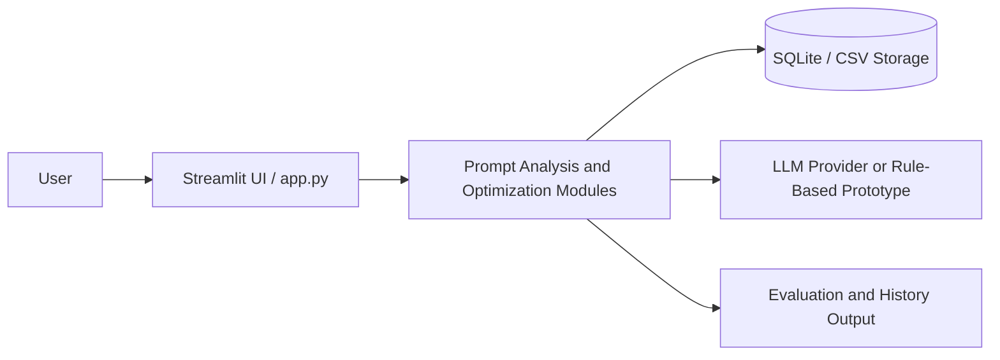

# System Design — PromptLab

## 1. Overview
PromptLab is a lightweight web application for analyzing, scoring, optimizing, and managing prompts for large language models. The current prototype focuses on a simple but practical workflow: users enter a prompt, receive a diagnosis, obtain a score, and get a clearer optimized version. The system is intentionally designed to be understandable, extendable, and suitable for classroom demonstration.

## 2. High-Level Architecture

## 3. Main Components

- Frontend: Streamlit-based interface in app.py for prompt input, scoring output, optimization results, and history display.
- Core modules in src/:
  - prompt_analyzer.py: analyzes prompt quality and assigns scores.
  - prompt_optimizer.py: rewrites prompts and explains improvements.
  - prompt_templates.py: stores reusable prompt templates for different task categories.
  - survey_analysis.py: processes survey and evaluation data for reporting.
- Data layer: lightweight local storage such as CSV and SQLite for prompt logs, version history, and evaluation records.
- Reporting layer: generates summaries and charts used in the report, demo, and presentation materials.

## 4. Prompt Lifecycle

1. User enters an original prompt.
2. The system checks the prompt for missing elements such as role, task clarity, context, constraints, and output format.
3. A score is produced based on a rubric and the prompt is compared against a set of quality rules.
4. The system generates an improved prompt and explains the rationale.
5. The result is stored as a new version so the user can compare improvements over time.

## 5. Data Flow

- Input: prompt text from the user.
- Processing: analysis and scoring logic run in the Python modules.
- Output: diagnostic feedback, a proposed revision, and generated summary data.
- Persistence: prompt versions and evaluation metadata are stored locally for later comparison.

This flow makes the system simple to test and easy to explain in an assignment or demo setting.

## 6. Suggested Data Model

- users: basic user metadata
- prompts: each prompt entry created by the user
- prompt_versions: original prompt, optimized prompt, score, timestamp, and notes
- evaluations: comparison results and quality metrics
- experiments: optional A/B test data for future iterations

## 7. Deployment and Extension Plan

- Prototype stage: local Streamlit app + CSV/SQLite storage.
- Next stage: add a backend API, structured database tables, and asynchronous jobs for batch evaluation.
- Future stage: connect to real LLM APIs, support multi-user collaboration, and provide team-level prompt libraries.

## 8. Why This Design Fits the Project

The design is intentionally lightweight and transparent. That makes it suitable for a student project because it can be implemented and explained clearly while still demonstrating the key value proposition of prompt evaluation and optimization.

