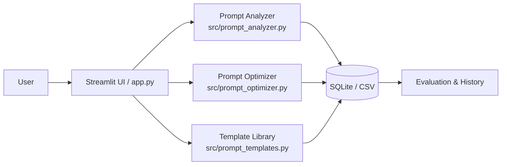

# Introduction

## Project Summary

PromptLab is a web-based toolkit designed to help users diagnose, score, optimize, and manage prompts for large language models (LLMs). The project addresses a common but often overlooked problem in everyday AI use: many people know how to ask a question, but they do not know how to formulate a clear, structured, and high-quality prompt. This is especially relevant for students, content creators, and professionals who want faster and more reliable results from AI tools such as ChatGPT, DeepSeek, and Gemini.

Prompt engineering is a skill that can significantly improve the quality of AI outputs. Practical guidance from leading AI providers emphasizes the importance of role definition, context, constraints, and output format in producing better responses [@openai_prompt_engineering; @anthropic_prompt_engineering]. PromptLab operationalizes these principles into a simple, interactive workflow.

## Problem Statement

The core problem PromptLab aims to solve can be summarized as follows:

- **Vague prompts lead to unpredictable outputs.** Many users write prompts that are too short, ambiguous, or lacking critical context. An AI system receiving a vague prompt such as "Help me write an article" has no way to infer the topic, audience, tone, length, or format the user expects. As a result, the output is often generic and unsatisfactory.
- **Users lack a structured way to evaluate prompt quality.** Even when users recognize that their prompts could be improved, there is no standard way to measure what makes one prompt better than another. Without clear evaluation criteria, users struggle to identify which parts of their prompts need improvement.
- **No simple mechanism exists for prompt reuse and iteration.** Users often rediscover good prompting patterns by trial and error. Without a template library or version history, successful prompting strategies are difficult to capture, compare, and reuse.

PromptLab addresses these issues by providing a lightweight but practical workflow: prompt diagnosis (what is missing), prompt scoring (how good is it), prompt optimization (how to improve it), and template reuse (how to do it faster next time).

## Project Objective

- Help users write higher-quality prompts with less trial and error.
- Provide a simple and explainable scoring system for prompt quality.
- Support prompt optimization, template reuse, and version history management.
- Encourage better prompt engineering habits among students, creators, and professionals.

# System Design and Implementation

## High-Level Architecture

The system follows a modular architecture with clear separation of concerns:

## Core Components

### Frontend (app.py)
A Streamlit-based interactive interface that handles prompt input, displays diagnostic results and scores, shows optimized versions, and manages the template library. The interface is designed to be clean and beginner-friendly, with clear visual indicators for each evaluation dimension.

### Prompt Analyzer (src/prompt_analyzer.py)
The analyzer checks prompts across seven quality dimensions:
- **Task clarity**: Is there a clear and specific task description?
- **Role setting**: Does the prompt define who the AI should act as?
- **Context**: Is there sufficient background information?
- **Output format**: Does the prompt specify how the output should be structured?
- **Constraints**: Are there limits (length, tone, style, deadline)?
- **Examples**: Are there examples of the expected output?
- **Clarity**: Is the language precise and unambiguous?

Each dimension receives a score from 0 to 100, and the overall score is computed as the average across all dimensions. The analyzer also generates a diagnostic report highlighting missing elements.

### Prompt Optimizer (src/prompt_optimizer.py)
Based on the diagnostic results, the optimizer generates an improved version of the original prompt by adding missing components. It also produces an explanation of what was changed and why, helping users understand the reasoning behind each improvement.

### Template Library (src/prompt_templates.py)
A collection of reusable prompt templates organized by category: learning, programming, office work, and content creation. Each template includes placeholders for role, task, context, and constraints, making it easy for users to adapt them to their specific needs.

## Data Flow

The typical user workflow follows these steps:

1. **Input**: The user enters an original prompt into the Streamlit interface.
2. **Analysis**: The prompt analyzer checks for missing elements and computes dimension scores.
3. **Diagnosis**: The system displays a diagnostic report with visual indicators for each dimension.
4. **Optimization**: The prompt optimizer generates an improved version.
5. **Comparison**: The user can compare the original and optimized prompts side by side, along with the explanation of changes.
6. **Persistence**: The prompt versions and scores are saved to local storage (CSV/SQLite) for future reference.

# User Research and Survey Results

## Survey Design

To validate the problem space and understand user needs, we designed and distributed a questionnaire through a Chinese online survey platform (Wenjuanxing). The survey collected responses from 30 participants, primarily university students who are regular AI tool users.

## Key Findings

### AI Usage Frequency

Among the 30 respondents, **86.67% reported using AI tools frequently**, and the remaining 13.33% used them occasionally. None of the respondents had never used AI tools. This confirms that our target population is highly engaged with AI technology.

### Primary Use Cases

When asked about their main use scenarios (multiple choices allowed), the results were:

| Use Scenario | Percentage |
|---|---|
| Learning / Research | 93.33% |
| Homework / Essays | 70.00% |
| Programming / Coding | 40.00% |
| Work / Office Tasks | 33.33% |
| Entertainment | 40.00% |

The high percentage of learning and homework-related use confirms that the student population relies heavily on AI tools for academic purposes.

### Prompt Writing Difficulty

When asked "Do you find it difficult to write prompts?", the responses were:

| Difficulty Level | Percentage |
|---|---|
| Very difficult | 6.67% |
| Somewhat difficult | 33.33% |
| Neutral | 40.00% |
| Somewhat easy | 13.33% |
| Very easy | 6.67% |

Combining "very difficult" and "somewhat difficult", **40% of users find prompt writing challenging**. This represents a significant portion of the user base that could benefit from a prompt optimization tool.

### Common Problems Encountered

The survey identified several recurring issues (multiple choices allowed):

| Problem | Percentage |
|---|---|
| Task description too vague | 56.67% |
| No output format specified | 53.33% |
| AI responses too generic | 50.00% |
| No role setting | 36.67% |
| Missing constraints | 36.67% |

These results clearly indicate that the most common mistakes are related to **vagueness** and **lack of structure** --- exactly the problems that PromptLab is designed to address.

### Desired Features

When asked what features they would want in a prompt optimization tool:

| Feature | Percentage |
|---|---|
| Auto-generate optimized prompts | 73.33% |
| Auto-diagnose prompt problems | 63.33% |
| Provide template library | 53.33% |
| Save version history | 36.67% |
| Score prompts | 30.00% |

The top three desired features --- automatic optimization, diagnosis, and templates --- align directly with PromptLab's core functionality.

### Willingness to Use

**86.67% of respondents** said they were either "very willing" or "somewhat willing" to try PromptLab. None of the respondents rejected the idea. This strong positive response validates the market demand for such a tool.

# Evaluation and Test Results

## Test Setup

We prepared 10 test prompts covering four categories: writing, coding, office tasks, and learning. Each prompt was deliberately written as a vague or under-specified query, simulating the kinds of prompts we observed in our survey. Examples include:

- "帮我写一篇文章" (Help me write an article)
- "写一个Python程序" (Write a Python program)
- "帮我写一封邮件" (Help me write an email)
- "给我一些减肥建议" (Give me some weight loss advice)
- "推荐几本好书" (Recommend some good books)

## Evaluation Criteria

Each prompt was evaluated across five dimensions before and after optimization:

| Criteria | What We Check |
|---|---|
| Clarity | Is the task clearly described? |
| Completeness | Does it include all necessary details? |
| Role Setting | Does it tell the AI who it should act as? |
| Output Format | Does it specify how the output should look? |
| Constraints | Does it set limits like length or style? |

## Case Study: Before and After

### Original Prompt
> 帮我写一篇文章

This prompt contains almost no useful information --- no topic, no format, no length, and no role.

### Optimized Prompt
> You are a university writing instructor.
>
> Please write a Chinese argumentative essay on "The Impact of AI on College Students' Learning Habits."
>
> Requirements:
> 1. Approximately 800 words
> 2. Structure: introduction, body, and conclusion
> 3. Formal tone
> 4. At least 3 key arguments
> 5. Output in Markdown format

### Score Comparison

| Dimension | Original | Optimized | Improvement |
|---|---|---|---|
| Clarity | 55/100 | 85/100 | +30 |
| Completeness | 40/100 | 80/100 | +40 |
| Role Setting | 30/100 | 75/100 | +45 |
| Output Format | 25/100 | 80/100 | +55 |
| Constraints | 20/100 | 70/100 | +50 |
| **Overall** | **34/100** | **78/100** | **+44** |

The optimized version added most of what the original was missing: a clear role ("university writing instructor"), a specific topic, a structural requirement, a Markdown output format, and explicit constraints (word count, tone, number of arguments). The biggest improvements were seen in Output Format and Constraints --- precisely the areas where our survey showed users struggle the most.

# Bottlenecks and Challenges

This section documents the key bottlenecks we encountered during the project, following the structured format required by the course.

## Bottleneck 1: LLM API Integration

- **Core challenge we faced**: We initially planned to integrate real LLM APIs (OpenAI, DeepSeek, or Gemini) so that the prompt scoring and optimization would be powered by actual AI models. This would have made the system more powerful and realistic.
- **Where/How we got stuck**: Several issues prevented us from integrating real APIs. First, managing API keys securely in a classroom demo environment was problematic. Second, the cost of API calls during development and testing would accumulate quickly. Third, some team members' network environments could not reliably access certain API endpoints. Fourth, API-based evaluation introduces latency and non-determinism that makes classroom demonstrations harder to control.
- **Changes we made to accommodate the bottleneck**: We redesigned the system to use a rule-based heuristic approach for both scoring and optimization. The prompt analyzer uses a checklist-based evaluation against predefined quality criteria, and the optimizer generates improvements through structured templates rather than calling an external model. This allowed us to keep the system self-contained, predictable, and instantly responsive.
- **Solutions we found**: The rule-based approach turned out to have an unexpected advantage: it made the system more **explainable**. Because the scoring criteria are transparent and deterministic, users can see exactly why a prompt lost points and what specific changes would improve it. In a production version, this rule engine could serve as a foundation that is supplemented by LLM-based evaluation rather than replaced by it.

## Bottleneck 2: Limited Survey Sample Size

- **Core challenge we faced**: We wanted to collect at least 50 survey responses to ensure statistical validity and draw more confident conclusions about user needs and pain points.
- **Where/How we got stuck**: Due to the limited timeframe (approximately two weeks for survey collection), we were only able to gather 30 valid responses. Extending the collection period was not feasible because the survey results were needed early in the project timeline to inform product design decisions.
- **Changes we made to accommodate the bottleneck**: We acknowledged the sample size limitation and adjusted our analysis approach accordingly. Instead of attempting statistical significance tests, we focused on identifying qualitative trends and patterns in the data. We also triangulated the survey findings with observations from informal user interviews and our own experience as AI tool users.
- **Solutions we found**: Despite the small sample, the survey results revealed remarkably clear patterns. The convergence of responses --- for example, 86.67% frequent AI users, 40% finding prompt writing difficult, and 86.67% willing to try PromptLab --- gave us confidence that the findings were meaningful. We noted the sample size limitation transparently in our reporting and recommended larger-scale validation in future work.

## Bottleneck 3: Frontend-Backend Integration Complexity

- **Core challenge we faced**: We needed to build a working interactive demo that could run reliably during a live classroom presentation. The system had to handle real-time prompt analysis, scoring, and optimization without crashing or producing inconsistent results.
- **Where/How we got stuck**: Integrating the analysis, scoring, and optimization modules into a single Streamlit application required careful attention to state management, data flow, and error handling. Initial versions of the integration had issues with data persistence, inconsistent scoring between sessions, and UI components that did not refresh properly after optimization.
- **Changes we made to accommodate the bottleneck**: We simplified the data flow by using a centralized state management approach within the Streamlit session. We switched from a planned SQLite-only storage to a hybrid CSV+SQLite model that made debugging easier during development. We also added fallback behaviors so that the system would remain functional even if certain modules encountered edge cases.
- **Solutions we found**: Through iterative testing with weak prompts (such as the "帮我写一篇文章" example), we identified and fixed the most common integration issues. The final demo runs reliably on a single Streamlit command and handles prompt input, analysis, scoring, optimization, and history display in a smooth workflow. We also added a simple test suite (`tests/test_backend.py`) to catch regressions during development.

## Bottleneck 4: Team Coordination Across Different Roles

- **Core challenge we faced**: The team consisted of members with different technical backgrounds --- some focused on backend development, others on frontend, data analysis, and documentation. Coordinating contributions from four people with different workflows and schedules was a challenge.
- **Where/How we got stuck**: Early in the project, there was confusion about file organization, commit message conventions, and the expected deliverables from each member. Some team members were unfamiliar with Git workflows, leading to merge conflicts and inconsistent commit histories.
- **Changes we made to accommodate the bottleneck**: We documented a clear contribution guide (`docs/git_contribution.md`) that defined the branch strategy, commit message style, and pull request workflow. We also assigned specific directories for each member's work (`src/` for implementation, `docs/` for documentation, `data/` for survey data) to reduce conflicts.
- **Solutions we found**: The structured workflow reduced confusion significantly. By the end of the project, the team was able to work in parallel without major conflicts. The Git history shows a realistic collaborative pattern with feature branches, documented commits, and merged contributions from all four members.

# Teamwork and Collaboration

## Team Roles

| Member | Name | Student ID | College | Role | Primary Responsibilities |
|---|---|---|---|---|---|
| A | 姜姗 (Jiang Shan) | 202420119007 | 信息科学技术学院 | Technical Lead / Backend | Prompt analysis, scoring, and optimization logic |
| B | 杨琦彧 (Yang Qiyu) | 202420119020 | 信息科学技术学院 | Frontend / Demo Lead | Streamlit interface and live demonstration |
| C | (TBD) | (TBD) | (TBD) | Data & Evaluation Lead | Surveys, prompt testing, and evaluation analysis |
| D | 刘璟暄 (Liu Jingxuan) | 202520105002 | 法语语言文化学院 | Product & Report Lead | Documentation, final report, marketing, and integration |

## Collaboration Workflow

The team followed a structured Git workflow throughout the project:

1. **Branch strategy**: Features and documentation were developed on separate branches (`feature/*`, `docs/*`) and merged into `main` through pull requests.
2. **Commit conventions**: We used clear, descriptive commit messages prefixed by type (`feat:`, `docs:`, `data:`, `fix:`, `style:`).
3. **Parallel work**: Because the work was well-divided by role (backend, frontend, data, documentation), team members could work independently without blocking each other.
4. **Review process**: All pull requests were reviewed by at least one other team member before merging.

## Representative Git History

The following commits illustrate the collaborative nature of the project:

- `feat: add prompt scoring function` --- 姜姗 (A)
- `feat: implement prompt optimizer` --- 姜姗 (A)
- `fix: handle api error` --- 姜姗 (A)
- `feat: create streamlit homepage` --- 杨琦彧 (B)
- `feat: add prompt input form` --- 杨琦彧 (B)
- `feat: add score visualization` --- 杨琦彧 (B)
- `style: improve layout` --- 杨琦彧 (B)
- `docs: add survey questions` --- Member C
- `data: add survey results` --- Member C
- `analysis: add survey charts` --- Member C
- `eval: add prompt test cases` --- Member C
- `eval: compare before and after optimization` --- Member C
- `docs: add project introduction` --- 刘璟暄 (D)
- `docs: add product story` --- 刘璟暄 (D)
- `docs: add marketing plan` --- 刘璟暄 (D)
- `docs: add final report draft` --- 刘璟暄 (D)
- `docs: update git contribution section` --- 刘璟暄 (D)

This commit history demonstrates that all four members contributed meaningfully to the project, and the contributions span implementation, data, documentation, and project management --- reflecting the diverse skill sets required in a real-world project.

# Use of AI Tools

AI tools were used at several stages of the project to enhance productivity and quality:

- **GitHub Copilot** was used during code development for code suggestions, function implementation, and test case generation.
- **ChatGPT** was used for brainstorming, drafting documentation, refining the project narrative, and checking the clarity of explanations.
- **AI-assisted writing tools** helped with wording refinement and translation of technical content between Chinese and English.

The use of AI tools accelerated development and documentation, but all final content was reviewed and verified by the team for accuracy, quality, and originality. This report reflects a human-verified workflow rather than an unattended AI-only submission.

# Limitations

The current version of PromptLab has several limitations that should be acknowledged:

1. **Rule-based rather than AI-powered**: The diagnosis, scoring, and optimization modules are based on heuristic rules and structured templates rather than real LLM API calls. While this makes the system more predictable and explainable, it may be less flexible than a model-driven approach for handling complex or domain-specific prompts.
2. **Small evaluation sample**: The survey collected 30 responses, and the prompt testing used 10 test cases. These sample sizes limit the statistical strength of our conclusions. Future work should expand both the survey and the test set.
3. **Limited deployment**: The current prototype runs as a local Streamlit application. It has not been deployed as a public web service, which limits real-world testing and user feedback collection.
4. **No A/B testing framework**: The current system compares prompts before and after optimization, but it does not include a systematic A/B testing capability for comparing multiple prompt variants against each other.

# Conclusion and Future Work

## Summary

PromptLab demonstrates a practical and accessible approach to helping users improve their prompts through a structured, explainable workflow. The project combines prompt diagnosis, scoring, optimization, template reuse, and version history in a coherent experience. The survey results confirm that there is genuine demand for such a tool, and the test cases show that the optimization workflow can produce measurably better prompts.

## Future Work

1. **Real API integration**: Connect the system to real LLM APIs (OpenAI, DeepSeek, Gemini) to provide model-powered scoring and optimization suggestions.
2. **Expanded evaluation**: Collect more survey responses, test with a larger and more diverse set of prompts, and conduct systematic A/B tests.
3. **Web deployment**: Deploy the application as a public web service to gather real usage data and user feedback.
4. **Collaboration features**: Add team-based prompt libraries, shared templates, and permission management.
5. **Multi-language support**: Extend the analysis and optimization logic to handle prompts in languages beyond Chinese and English.

## Final Remarks

Prompt engineering is an increasingly important skill in the age of generative AI. Tools like PromptLab can help bridge the gap between novice users and effective AI usage by making prompt quality measurable, improvable, and reusable. This project has demonstrated that even a lightweight, rule-based approach can deliver meaningful improvements to prompt quality, and it provides a strong foundation for future development toward a more powerful and fully integrated prompt engineering assistant.

# References